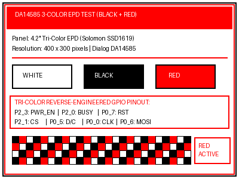

# DA14585 4.2" Smart E-Ink Display Reverse-Engineering & Driver Suite

Complete reverse-engineering documentation, bare-metal C drivers, Python hardware test suites, and BLE transmitters for the Dialog Semiconductor (Renesas) **DA14585** Bluetooth Low Energy 4.2-inch Electronic Paper Display (EPD).



---

## 1. Hardware Architecture

* **Microcontroller**: Dialog / Renesas **DA14585**
  * **Architecture**: ARM Cortex-M0 (ARMv6-M Thumb-1, 16 MHz system clock)
  * **Internal Memory**: 96 KB SysRAM (4 banks), 64 KB Boot ROM, 64 KB OTP
* **Display Controller**: Solomon Systech **SSD1619 / SSD1683** family
* **Display Panel**: 4.2-inch Tri-Color E-Paper Display (EPD)
  * **Resolution**: 400 &times; 300 pixels (50 bytes/scanline &times; 300 lines = 15,000 bytes/plane)
  * **Colors**: Monochrome / Tri-Color (White, Black, Red)
* **Non-Volatile Storage**: Fudan Micro **FM25Q04** (512 KB SPI NOR Flash, JEDEC ID: `0xA14013`)
* **Debug Interface**: ST-Link V2 USB debugger connected via SWD

---

## 2. Hardware Pinout & Multiplexing Map

The board shares SPI bus lines between the external SPI NOR flash and the E-Ink display controller:

| Pin | Function | Direction | Active Level | Default State | Description |
|:---|:---|:---:|:---:|:---:|:---|
| **`P0_0`** | `SPI_CLK` | Output | Clock Pulse | Low | Shared SPI Clock for Flash & E-Ink controller |
| **`P0_3`** | `FLASH_CS` | Output | Active-LOW | High (Inactive) | External SPI NOR Flash Chip Select |
| **`P0_4`** | `STATUS_LED` | Output | Active-LOW / Pulse | High / Hi-Z | Status LED indicator (toggled during BLE events & display update) |
| **`P0_5`** | `EPD_DC` / `FLASH_MISO` | Multiplexed | `0`=Cmd, `1`=Data | Low | Flash MISO input during flash reads; E-Ink Data/Command output during screen updates |
| **`P0_6`** | `SPI_MOSI` | Output | Data bit | Low | Shared SPI Master Out Slave In (`DIN` to display, `DI` to flash) |
| **`P0_7`** | `EPD_RST` | Output | Active-LOW | High (Inactive) | Display Hardware Reset (pulse: High &rarr; Low 20ms &rarr; High 20ms) |
| **`P2_0`** | `EPD_BUSY` | Input | Active-HIGH | Low (Idle) | Display Busy Line (`1` = Busy executing refresh, `0` = Idle / Ready) |
| **`P2_1`** | `EPD_CS` | Output | Active-LOW | High (Inactive) | Display Controller Chip Select |
| **`P2_3`** | `EPD_PWR_EN` | Output | Active-HIGH | Low (Off) | Display Power / High-Voltage PMIC & Boost Converter Enable |

---

## 3. Critical Hardware Rules & Safety Constraints

### ⚠️ Rule 1: Reset Line is Active-HIGH (`RST`)
* **DO NOT connect ST-Link `NRST` to the board!**
* Standard ARM debuggers pull `NRST` active-LOW. The DA14585 reset pin is **active-HIGH** (pulled low on-board; pulled to 3.3V to reset). Connecting an active-low debugger reset pin will hold the chip in permanent reset.
* Debugger sessions must connect in `attach` mode (`connect_mode="attach"`).

### ⚠️ Rule 2: Extended Sleep & SWD Latch Window
* The production firmware puts the SoC into sleep between advertising pulses, powering down debug domain `PD_DBG`.
* If SWD fails with `STLink error (9): Get IDCODE error`, run connection scripts with a retry loop (`--timeout 30`) and momentarily touch the `RST` pad to 3.3V to latch onto the core during the ~100 ms bootloader execution window.

### ⚠️ Rule 3: Hardware Watchdog Freezing
* The DA14585 hardware watchdog (`WATCHDOG_REG` at `0x50003100`) resets the chip after ~2.6 seconds if not petted.
* Immediately upon halting the core via SWD, set bit 3 (`FRZ_WDOG`) in `SET_FREEZE_REG`:
  ```python
  target.write16(0x50003300, 0x0008)
  ```

---

## 4. Display Controller Architecture & Tri-Color RAM Mapping

### Dual-Plane Pixel Truth Table (SSD1619)
The display controller maintains two internal 15,000-byte RAM buffers:
1. **Command `0x24` (`WRITE_RAM_BW`)**: Black/White RAM plane
2. **Command `0x26` (`WRITE_RAM_RED`)**: Red RAM plane

| Desired Pixel Color | `0x24` (BW RAM Bit) | `0x26` (RED RAM Bit) | Electrophoretic Result |
|:---|:---:|:---:|:---|
| **White** | `1` | `0` | Clean reflective white background |
| **Black** | `0` | `0` | Deep black pigment |
| **Red** | `1` | `1` | High-chroma red particles |

### Refresh Sequence & Timing
1. **Power On**: Set `P2_3` (`EPD_PWR_EN`) = `1` (Enable boost converter / PMIC). Delay 30 ms.
2. **Hardware Reset**: Pulse `P0_7` (`EPD_RST`): `High` &rarr; `Low` (30 ms) &rarr; `High` (30 ms). Wait `P2_0` (`EPD_BUSY`) == `0`.
3. **Software Initialization**:
   * Command `0x12` (`SW_RESET`), wait BUSY == 0.
   * Command `0x3C` (`BORDER_WAVEFORM_CONTROL`): Data `0x01`.
   * Command `0x18` (`TEMP_SENSOR_CONTROL`): Data `0x80`.
   * Command `0x11` (`DATA_ENTRY_MODE`): Data `0x03` (AM=0, ID=11).
   * Command `0x44` (`SET_RAM_X_START_END`): Data `0x00`, `0x31` (0 to 49 = 50 bytes = 400 pixels).
   * Command `0x45` (`SET_RAM_Y_START_END`): Data `0x00`, `0x00`, `0x2B`, `0x01` (0 to 299 = 300 lines).
   * Command `0x4E` (`SET_RAM_X_COUNTER`): Data `0x00`.
   * Command `0x4F` (`SET_RAM_Y_COUNTER`): Data `0x00`, `0x00`.
4. **Stream Framebuffers**:
   * Command `0x24` &rarr; Stream 15,000 bytes BW RAM.
   * Command `0x26` &rarr; Stream 15,000 bytes RED RAM.
5. **Trigger Master Activation**:
   * Command `0x22` (`DISPLAY_UPDATE_CONTROL_2`): Data `0xF7`.
   * Command `0x20` (`MASTER_ACTIVATION`).
   * Poll `P2_0` (`EPD_BUSY`) == `0` while feeding watchdog (Hardware-measured electrophoretic refresh duration: **17.08 seconds**).
6. **Deep Sleep**:
   * Command `0x10` (`DEEP_SLEEP_MODE`): Data `0x01`.
   * Set `P2_3` (`EPD_PWR_EN`) = `0` (Shut down PMIC).
7. **Permanent Image Retention**:
   * E-Ink is intrinsically bi-stable and draws 0.00 &mu;A when powered off.
   * *Stock Firmware Warning*: If the DA14585 watchdog resets the SoC, the factory firmware in external flash boots, runs `memset(framebuffer, 0xFF, 15000)`, and refreshes the screen back to blank white.
   * *Solution*: The test stubs enter an active low-overhead idle loop (`safe_idle`) in SysRAM4 that reloads `WATCHDOG_REG` (`0x50003100 = 0xC8`) every ~250 ms, keeping the custom image permanently retained. The image will also remain indefinitely if you disconnect power completely.

---

## 5. Bluetooth Low Energy (BLE) Profile

The factory firmware exposes a custom GATT service for wireless over-the-air screen updates:

* **Device Complete Local Name**: `EINK-V115-42000` (or `EINK-V113-42000`)
* **Primary Display Service UUID**:
  * RFC4122: `afdbecdd-1234-abcd-2007-aabbccddeeff`
  * Wire / Little-Endian: `FF EE DD CC BB AA 07 20 CD AB 34 12 DD EC DB AF`
* **Command / Control Characteristic**:
  * UUID: `9e1547ba-c365-57b5-2947-c5e1c1e1d528`
  * Properties: `Write`, `Notify` (Max Length: 20 bytes)
  * Opcodes: `0x06` (Refresh Display), `0x07` (Clear Screen), `0x08` (Status Query)
* **Image Data Stream Characteristic**:
  * UUID: `772ae377-b3d2-4f8e-4042-5481d121199c`
  * Properties: `Write Without Response`, `Write` (Max Length: 247 bytes MTU)
  * Direct destination: Injected into RAM framebuffer at `0x07FCF908` in 6 slices of 2,500 bytes.

---

## 6. Project Tooling & File Reference

| File | Purpose |
|:---|:---|
| [`flash_spi_firmware.py`](flash_spi_firmware.py) | **Standalone SPI NOR Flash Writer**: Open-source programmer using ST-Link V2. Supports erase (4KB/64KB/chip), smart page write, and SHA256 verify without Segger J-Link or ezFlashCLI. |
| [`display_image.py`](display_image.py) | **Universal Image Pipeline**: Converts Photoshop PNG/BMP artwork into tri-color framebuffers and flashes directly to the e-ink screen in silicon. |
| [`test_eink_red.py`](test_eink_red.py) | **In-silicon Tri-Color Hardware Test**: Injects dual BW and Red framebuffers into SysRAM, triggers 3-color panel refresh, and maintains permanent retention. |
| [`generate_red_test_image.py`](generate_red_test_image.py) | **Tri-Color Generator**: Creates 400&times;300 PIL graphic with red banner, borders, color swatches, and checkerboard; exports dual 15,000-byte buffers. |
| [`test_eink_hardware.py`](test_eink_hardware.py) | **In-silicon Monochrome Hardware Test**: Injects 15,000-byte BW buffer and triggers full hardware refresh with watchdog retention. |
| [`generate_test_image.py`](generate_test_image.py) | **Monochrome Generator**: Creates 400&times;300 PIL monochrome pattern and exports `test_framebuffer_15k.bin`. |
| [`check_target_now.py`](check_target_now.py) | Real-time diagnostic tool to inspect target state, registers (PC, SP, LR), GPIO registers, and completion flags. |
| [`da14585_probe.py`](da14585_probe.py) | SWD bring-up probe, register dumper, and vector table inspector. |
| [`dump_spi_flash.py`](dump_spi_flash.py) | High-speed SWD RAM-injected external SPI NOR flash dumper (FM25Q04 512 KB). |
| [`extract_partitions.py`](extract_partitions.py) | Flash partition carver for bootloader, dual app images, LUTs, and NVDS. |
| [`ssd1619.h`](ssd1619.h) / [`ssd1619.c`](ssd1619.c) | Standalone, open-source bare-metal C driver for Solomon SSD1619 / SSD1683 displays. |
| [`ble_eink_client.py`](ble_eink_client.py) | Cross-platform Python Bleak client for pushing custom images wirelessly over BLE. |
| [`AGENTS.md`](AGENTS.md) | Deep technical reference, memory maps, register tables, and firmware reverse-engineering notes. |

---

## 7. Quick Start Guide

### Hardware Connection (ST-Link V2 &rarr; DA14585 Board)
```text
ST-Link Pin      DA14585 Tag Pad
-----------      ---------------
GND         <->  GND
3.3V        <->  3.3V / VDD
SWDIO       <->  SWDIO
SWCLK       <->  SWCLK
NRST        <->  [DO NOT CONNECT! Reset is active-HIGH]
```

### 1. Run SWD Target Diagnostic
```bash
python check_target_now.py
```

### 2. Generate and Render 3-Color Image (Black + White + Red)
```bash
python generate_red_test_image.py
python test_eink_red.py
```

### 3. Generate and Render Monochrome Image
```bash
python generate_test_image.py
python test_eink_hardware.py
```

### 4. Transmit Image Wirelessly over BLE
```bash
python ble_eink_client.py --image test_pattern_400x300.png
```

---

## 8. Custom Firmware Development & Standalone Flashing

You can build and deploy your own bare-metal C applications with full BLE peripheral stack using the GNU Arm Embedded Toolchain (`arm-none-eabi-gcc`) and program them directly to the FM25Q04 SPI NOR flash via ST-Link V2.

> [!TIP]
> **Switching to a Linux machine?** See [`HANDOFF.md`](HANDOFF.md) for a complete setup guide covering Linux packages, udev rules, SDK paths, and commands.

### Prerequisites
* **Arm GNU Toolchain**: `arm-none-eabi-gcc` 10.x / 14.x
* **Build System**: GNU Make
* **Python Dependencies**: `pip install pyocd Pillow bleak`
* **DA145xx SDK**: Renesas / Dialog DA145xx SDK 6.0.24.1464 (or 6.0.22.1401)

### 1. Build Custom BLE Firmware
```bash
cd firmware
make SDK_PATH=/path/to/DA145xx_SDK/6.0.24.1464 all
```
* Compiles SDK BLE stack (`rwip`, `ke`, `gapc`, `gapm`, profiles), custom GATT service (`custs1`), E-Ink application callbacks (`user_eink_app.c`), and display driver (`ssd1619.c`).
* Links using [`firmware/ldscript_ble.lds.S`](firmware/ldscript_ble.lds.S) with a 2 KB dedicated stack (`__StackTop = 0x07FCF700`).
* Generates `build/eink_ble_firmware.bin` (~29.8 KB) and packages it into `build/eink_ble_firmware.img` with a 64-byte Dialog Image Header (`s_imageHeader`, imageid=3) via [`mkimage.py`](firmware/mkimage.py).

### 2. Flash Directly to SPI NOR Flash via ST-Link V2
```bash
make SDK_PATH=/path/to/DA145xx_SDK/6.0.24.1464 flash
```
Or run the flasher directly from the root directory:
```bash
python flash_spi_firmware.py write firmware/build/eink_ble_firmware.img --addr 0x004000 --reset
```
* **No Segger J-Link or proprietary tools required!**
* Automatically wakes the FM25Q04 NOR flash from deep sleep (`0xAB`).
* Erases required 4 KB sectors and programs 256-byte pages via an injected 1,008-byte Thumb-1 RAM stub ([`flash_raw.bin`](flash_raw.bin)).
* Verifies written data bit-by-bit against the local image (100% bit-exact).
* Issues software reset: the chip boots via the Dialog secondary bootloader, copies Image 1 into SysRAM1, sets remap address 2, and runs the custom BLE firmware.
* The board boots, signals initialization with double-blink on the status LED, and begins advertising as `EINK-V115-42000`.

### 3. Wirelessly Upload Images over BLE
```bash
python ble_eink_client.py --image test_pattern_red_400x300.png
```
* Scans and connects to the display board over BLE (MTU 247).
* Sends Command `0x07` (clear buffer).
* Streams 30,000 bytes (dual-plane BW + Red) in 125 offset-tagged chunks at ~7.6 KB/s in ~3.8 seconds.
* Sends Command `0x06` (refresh trigger).
* Display driver executes 17-second physical refresh and powers down the high-voltage boost PMIC.
* Image is retained permanently with 0.00 &mu;A power draw!


